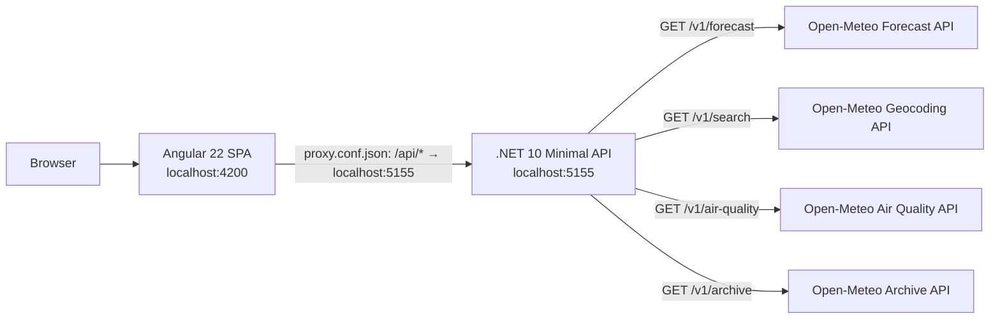

# Kiến trúc — weather-app

Tài liệu này mô tả kiến trúc chuẩn cho code sắp viết của repo. Repo là monorepo gồm hai phần: `/backend` (.NET 10 Minimal API, C#) và `/frontend` (Angular 22, TypeScript).

## Sơ đồ tổng quan

- Browser chỉ nói chuyện với SPA và (qua proxy dev) với backend — **không bao giờ** gọi thẳng Open-Meteo (xem ADR-001).
- Trong môi trường dev, Angular dev server proxy mọi request `/api/*` sang backend qua `frontend/proxy.conf.json`.

## Các layer

### Frontend — `/frontend` (Angular 22)

- Standalone component, **không dùng NgModule**; file đặt tên kiểu mới `app.ts` / `app.html` / `app.css` (không hậu tố `.component`).
- `ChangeDetectionStrategy.OnPush` mặc định, chạy **zoneless**, state bằng **signals**; control flow template dùng `@if` / `@for` / `@switch`; DI bằng `inject()` thay constructor.
- Mọi GET dữ liệu dùng **`httpResource`** trỏ tới `/api/weather`, `/api/geocode` và `/api/air-quality` (đường dẫn tương đối, proxy lo phần còn lại). Form dùng **Signal Forms**. Không dùng RxJS khi signal làm được.
- Chạy dev: `cd frontend && ng serve` → http://localhost:4200. Test: `cd frontend && ng test`.

### Backend — `/backend` (.NET 10 Minimal API)

- Endpoint gom theo domain bằng `MapGroup`: group `/api/weather`, `/api/geocode`, `/api/air-quality` và `/api/history` — 4 endpoint (chi tiết trong [docs/API.md](API.md)):
  - `GET /api/weather?lat={double}&lon={double}&days={int, mặc định 7}`
  - `GET /api/geocode?q={string}&count={int, mặc định 5}`
  - `GET /api/air-quality?lat={double}&lon={double}`
  - `GET /api/history?lat={double}&lon={double}`
- Gọi Open-Meteo qua **typed HttpClient** (`OpenMeteoClient`) đăng ký bằng `IHttpClientFactory`; URL Open-Meteo đặt trong `appsettings.json`, không hardcode trong code.
- DTO là `record`. Khi format số (lat/lon) vào URL upstream, luôn dùng `CultureInfo.InvariantCulture`.
- Mã lỗi: `400` khi param sai/thiếu, `502` khi Open-Meteo upstream lỗi.
- Chạy dev: `cd backend && dotnet run --urls http://localhost:5155`. Test: `cd backend && dotnet test WeatherApp.Api.Tests`.

### External — Open-Meteo

- Forecast: `https://api.open-meteo.com/v1/forecast`
- Geocoding: `https://geocoding-api.open-meteo.com/v1/search`
- Air Quality: `https://air-quality-api.open-meteo.com/v1/air-quality`
- Archive (lịch sử): `https://archive-api.open-meteo.com/v1/archive`
- Miễn phí, không cần API key. Chỉ backend gọi các URL này.

## ADR-001 — Proxy qua backend thay vì gọi Open-Meteo thẳng từ browser

### Context

SPA cần dữ liệu forecast và geocoding từ Open-Meteo. Có hai lựa chọn: browser gọi thẳng Open-Meteo, hoặc mọi request đi qua backend `/api/*`.

### Decision

Mọi request tới Open-Meteo đều đi qua .NET backend. Frontend chỉ biết `/api/weather`, `/api/geocode` và `/api/air-quality`.

### Consequences

- (+) Tránh vấn đề CORS phía browser và che URL provider khỏi client.
- (+) Có sẵn chỗ đặt cache server-side sau này (giảm số lần gọi upstream).
- (+) Dễ đổi weather provider mà không phải sửa frontend — contract `/api/*` giữ nguyên.
- (−) Thêm một hop mạng và backend phải map/chuẩn hóa response upstream.

## ADR-003 — Tile bản đồ (OSM/RainViewer) do browser tải thẳng, không qua backend

### Context

Feature bản đồ radar mưa cần tile ảnh nền (OpenStreetMap) và tile radar (RainViewer, miễn phí không key). ADR-001 quy định mọi dữ liệu đi qua backend `/api/*`.

### Decision

Tile ảnh bản đồ và metadata frames RainViewer do **browser tải thẳng** từ CDN của provider. Chỉ **dữ liệu thời tiết domain** (forecast/geocode/air-quality) mới bắt buộc qua backend.

### Consequences

- (+) Không nghẽn băng thông/latency qua Render free (mỗi lần pan/zoom là hàng chục tile ảnh).
- (+) Tận dụng CDN + cache của OSM/RainViewer; không cần key nên không có secret để che.
- (−) Frontend biết 2 origin ngoài (tile.openstreetmap.org, rainviewer.com) — đổi provider bản đồ phải sửa frontend, chấp nhận vì tile là tài nguyên hiển thị, không phải contract dữ liệu.

## ADR-002 — Chọn Open-Meteo làm weather provider

### Context

Cần một weather API có forecast theo tọa độ và geocoding theo tên địa điểm, phù hợp cho dự án research non-commercial, không muốn quản lý secret.

### Decision

Dùng Open-Meteo cho cả forecast (`/v1/forecast`) và geocoding (`/v1/search`).

### Consequences

- (+) Miễn phí, không cần API key → không lo lộ key, không cần secret management.
- (+) Không giới hạn khắt khe cho mục đích non-commercial.
- (+) Có sẵn cả forecast lẫn geocoding cùng một provider, giảm số integration phải viết.
- (−) Không có SLA thương mại; nếu cần SLA sau này, nhờ ADR-001 chỉ phải thay adapter phía backend.
